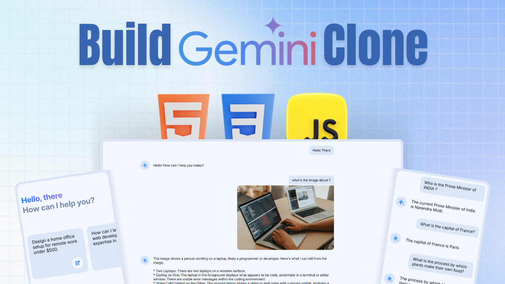

<div align="center">
  


[](https://twitter.com/intent/follow?screen_name=withaarzoo)
[](https://youtu.be/hmgG97mU-oo)

  <br />
  <br />

  <h2 align="center">Gemini Clone — AI Chat Interface using HTML, CSS & JavaScript</h2>

Welcome to the **Gemini Clone** project! This is a responsive, feature-packed AI-powered chat interface built entirely using **HTML, CSS, and JavaScript**, powered by **Google’s Gemini 2.0 Flash API**. Perfect for anyone exploring frontend development or building real-world AI tools — with zero frameworks!

  <div>
    <a href="https://youtu.be/hmgG97mU-oo"><strong>➥ Watch Tutorial</strong></a>
    <br>
    <br>
    <a href="https://t.me/codewithaarzoo"><strong>➥ Download Full Source Code</strong></a>
  </div>

</div>

---

## 📌 Key Features

🧠 **AI Chat Integration**  
- Uses Google Gemini 2.0 Flash API for smart responses  
- Supports both **text** and **file inputs** (images, PDFs, CSVs, etc.)

🎨 **Modern, Responsive UI**  
- Built with **HTML5, CSS3, JavaScript**  
- Clean layout with **dark/light mode toggle**

💬 **Interactive Chat Interface**  
- Typing animation for bot replies  
- Differentiated message bubbles for user and AI  
- Smooth auto-scroll for better UX

📂 **Smart File Uploads**  
- Upload & preview images or docs  
- Remove or cancel uploads easily  

🧩 **Reusable JS Components**  
- Modular code with helper functions like:  
  - `createMessageElement()`  
  - `applyTypingEffect()`  
  - `fetchBotResponse()`

📄 **Predefined Prompt Suggestions**  
- Encourages engagement with visual icons

🚨 **User Controls**  
- Stop bot mid-response  
- Clear all chats  
- Safety disclaimer included

🌐 **Robust Error Handling**  
- Graceful UI for failed API/network calls  

📱 **Mobile-Friendly Design**  
- Fully responsive, perfect on any device

---

## 🚀 Getting Started

To run this project locally:

```bash
git clone https://github.com/withaarzoo/Gemini-Clone.git
cd Gemini-Clone
open index.html
```

---

## 📂 Project Structure

```bash
Gemini-Clone/
├── index.html
├── style.css
├── script.js
├── assets/
│   ├── logos/
│   ├── icons/
│   └── sample-files/
```

---

## 🔗 Useful Links

- **Gemini Flash API**: [Visit Site](https://ai.google.dev/gemini-api/docs)
- **Google Fonts**: [Visit Site](https://fonts.google.com/)
- **Google Material Icons**: [Visit Site](https://fonts.google.com/icons)
- **Netlify**: [Visit Site](https://www.netlify.com/)

---

## 📥 Source Code

For full access to the source code, [click here](https://t.me/codewithaarzoo)

---

## 🎥 Video Tutorial

Need help building this from scratch?

📌 [Watch the Complete Tutorial on YouTube](https://youtu.be/hmgG97mU-oo)

---

## 🧑‍💻 Recommended For
- Beginner frontend developers
- AI/Chatbot enthusiasts
- Early college students
- Anyone interested in real-world JavaScript projects

---

## 🤝 Connect with Me

For collaborations or queries, reach out via **[Bento](https://bento.me/withaarzoo).**

---

## 🖼️ Thumbnail


